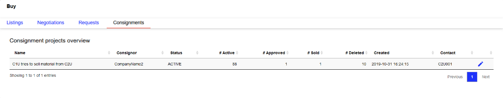
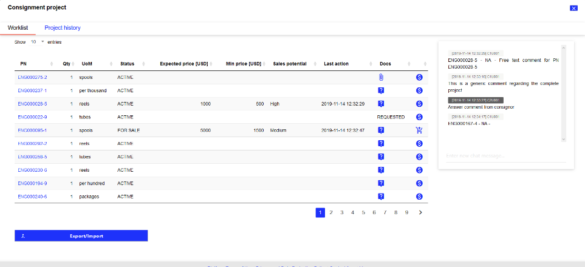
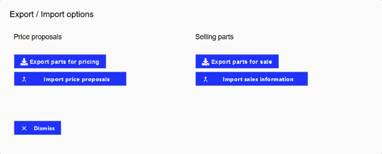
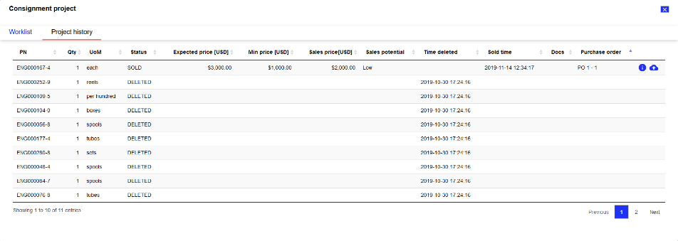

Consignee
---------

The consignment module for consignees is located at menu Buy under tab Consignments. There you can find an overview of all active consignment projects of your company where you have been assigned as the consignee.

Select a project
^^^^^^^^^^^^^^^^

   Consignee project overview

The overview table shows generic information and relevant KPIs about the consignment projects.

.. list-table:: 
   :class: tight-table
   :widths: 30 70
   :header-rows: 1

   * - Column
     - Description
   * - Name
     - Name / short description of the consignment project. This value is defined during project creation.
   * - Consignor
     - Company name of the consignor company.
   * - Status
     - Can be ACTIVE or CLOSED, indicating the overall status of the consignment project. A consignment project is active for as long as there is uploaded material that is neither deleted nor sold.
   * - # Active / # Approved / # Sold / # Deleted
     - These four columns indicate the total number of material positions within the different categories.
        
        - Active material is still part of the pricing process.
        - Approved material has an approved price proposal by the consignor and is ready to be sold by you.
        - Sold material has already been sold.
        - Deleted material has been removed from this project by the consignor.

   * - Created
     - Date and time when the consignment project was initially created.
   * - Contact
     - User ID that created the consignment project.

Clicking the Edit |edit| opens the detail screen for this project and allows you to manage the material of this consignment project. New consignment projects can only be created by the consignor. For more details see Consignor.

Manage an existing consignment project
^^^^^^^^^^^^^^^^^^^^^^^^^^^^^^^^^^^^^^
Clicking the Edit icon |edit| in the project overview table opens the details for the selected consignment project. The detail view consists of two screens: Worklist and Project history.

:Worklist: This screen shows the current material in this consignment project on part level including all relevant information about the consignment process. The main purpose of this screen is to allow the management of consigned material in the current project. It includes a chat window on the right side to communicate with the consignor on the platform.
:Project history: This screen shows deleted and sold material that was part of the consignment project.

Clicking on the Close button in the upper right corner |close| closes the detail view of the current consignment project and returns you to the project overview.

Price proposal process with consignor
=====================================
The core element of the consignment module is the price proposal process between consignor and consignee. All relevant actions for this process take place in the tab Worklist. The following diagram shows the price proposal process including the sales component at the end of the process.

[PROCESS DIAGRAM]

After material has been uploaded by the consignor, it will be displayed in the consignee worklist. To start the price proposal process, a minimum price (USD), an expected price (USD) and a sales potential has to be proposed for every material in the consignment project. To open the proposal dialogue window click on |dollar|. Here, you may enter the following fields:

:Minimum price (USD): Enter your minimum price in USD for which you are going to sell this part.
:Expected price (USD): Enter your price in USD for which you expect you are going to sell this part.
:Sales potential: Select your sales potential for this part based on your expertise and experience. Categories are: High, Medium, Low, and Scrap.
:(optional) New comment: You may enter additional comments or information for the respective part which will be shown in the chat history.

After submitting, the proposed prices are shown to the consignor for approval immediately. Price proposals can be changed until the consignor has approved the proposed prices. After agreeing on a set of prices for a material, the consignor approves a material for sale. Approved material is marked as FOR SALE. The proposed prices and sales potential are fixed and cannot be changed anymore.

If a company has also access to |mrosh| Connector, consignment material that is approved for sale is automatically listed on Connector. The sales price is set based on the agreed expected price for the material, adjusted with a factor that can be set up in company administration. The visibility is also set to a pre-defined value that can be managed in company administration. For more details about the settings, see :ref:`ref_superuser_settings_consignments`.

   Worklist screen

The screenshot on the right shows the tab Worklist for the consignee. The actual working list table shows all available parts in the currently selected consignment project. For each material, a set of actions is available to manage the material:

:PN details: By clicking on the part number a modal window shows additional information for this material: Generic material information based on the material catalogue on the platform and part specific information that have been uploaded by the consignor.
:Request documentation: If required, you can request documentation from the consignor by clicking on |request|. Parts where documentation has been requested are marked with status REQUESTED in the Docs column. Parts where documentation has already been uploaded are marked with |attachement| Clicking on this symbols shows a preview of the documentation file and allows the download of the documentation as a PDF document.
:Propose prices and sales potential: Clicking on |dollar| opens a dialogue window where you can enter the expected price, minimum price, and sales potential for a part. Additionally, a part specific comment can be entered which will be displayed in the chat window. For more details regarding the chat see Chat functionality.
:Add sales information: If you sold a part via other distribution channels than the IATA MRO SmartHub, the transaction details will have to be entered to make them available to the consignor. For more details see Add transaction information for sold material.

Chat functionality
==================
The chat module is located on the right side of the Worklist screen. The chat is dedicated to a particular consignment project and is only accessible from this screen. The chat window consists of the chat history showing all messages that have been sent here and the message input field. There are two types of messages inside the chat: material related messages and general messages. The header of a message contains the date and time the message was sent and the username of the sender.

Material related messages can be added when storing a new price proposal. These messages always contain a part number and serial number prefix to indicate the material they are related to.

General messages can be entered in the input field below the chat history. They are sent by pressing the Enter key on your keyboard.
Add transaction information for sold material

After having sold consigned material, you have to provide the transaction information to update the consignment project. Clicking on Add sales information |shoppingcart| opens a dialogue window where you may enter transaction related information. There are  required fields which have to be supplied by the consignee: buyer company name, sales price (USD), sales quantity, purchase order number, and purchase order position. All other fields are optional. Based on the agreement you may have with the consignor, it may be necessary to add optional information, e.g., if the consignor has to ship the material directly to the purchasing company.

Export and import functionality
^^^^^^^^^^^^^^^^^^^^^^^^^^^^^^^
The Worklist screen offers the possibility to export consignment material for managing price proposals with other tools or extracting part information for external sales. To update the consignment project in the IATA MRO SmartHub, you may also fill these exports with your information and import them to the project. Clicking on Export/Import button starts the export or import feature by showing a dialogue window where the desired action can be selected.

   Export and import options

Export parts for pricing
========================
Clicking on Export parts for pricing downloads a CSV file with all parts of the current consignment project with status ACTIVE. The export contains all material information and template columns to add a price proposal for each material. If a material already has a price proposal, these values are also exported and provided in the CSV file.

Import price proposals
======================
After exporting a parts list for pricing as described above, you can now add new price proposals or change existing ones in the exported CSV file. The following columns can be manipulated:

:min_price_usd: Enter your minimum price in USD for which you are going to sell this part in this column.
:expected_price_usd: Enter your price in USD for which you expect you are going to sell this part in this colum.
:sales_potential: Enter your sales potential for this part based on your expertise and experience. Valid values are: High, Medium, Low, and Scrap.
:(optional) comment: You may enter additional comments or information for the respective part which will be shown in the chat history.

To update the consignment project and provide the new price proposals to the consignor, the enriched CSV file can then be imported into the IATA MRO SmartHub by clicking on Import price proposals. To successfully upload the enriched CSV file, there are some restrictions regarding formatting and manipulation:

- To correctly process the uploaded data, please do not change the column order.
- Minimum price and expected price have to be formatted as numbers, without currency formats or any other characters. If you want to enter numbers with decimals, please use American notation and separate decimals with a point.
- The values in column sales potential have to be one the following: Scrap, Low, Medium, High
- Any entered comments have to be formatted as string without special characters.

When new data is imported, the existing data is updated. Material where the price proposal has not changed or nothing has been added, is not updated. If a new price proposal has been added the respective values are updated. This feature allows you to upload price proposals via CSV with the possibility to change only a specific set of price proposals.

Export parts for sale
=====================
Clicking on Export parts for sale downloads a CSV file with all parts of the current consignment project in status FOR SALE. The export contains all material information and template columns to add all relevant sales information if applicable.

Import sales information
========================
After exporting a part list for adding sales information, you can now add new sales information. The following columns can be manipulated:

:transaction_price_usd: Add the sales price in USD in this column.
:transaction_qty: Enter the transaction quantity in this column.
:external_buyer_name: Enter the buying company in this column.
:(optional) external_platform: The platform on which the transaction happened in this column.
:(optional) purchase_order_no: If the buyer already provided a purchase order number add it to this column.
:(optional) purchase_order_position: If the buyer already provided a purchase order position add it to this column.
:(optional) purchase_order_date: Enter the transaction date in this column.
:(optional) seller_reference_no: If you want to provide a purchase reference or project name add it to this column.
:(optional) Shipping information: If available you can enter the shipping information in the columns 'ship_to', 'ship_via_method', 'address_line_01', 'address_line_02', 'address_line_03', 'zip_code', 'state', 'country', 'freight_account', 'vat_id'.

To update the consignment project and provide the new sales information to the consignor, the enriched CSV file can then be imported into the IATA MRO SmartHub by clicking on Import sales information  To successfully upload the enriched CSV file, there are some restrictions regarding formatting and manipulation:

- To correctly process the uploaded data, please do not change the column order.
- Transaction price and transaction quantity have to be formatted as numbers, without currency formats or any other characters. If you want to enter numbers with decimals, please use American notation and separate decimals with a point.
- Any entered external buyer name, external platform, purchase order number, or seller reference number have to be formatted as a character string without special characters.
- Purchase order positions have to be integer values.
- The purchase order date has to be a date in the format YYYY-MM-DD or YYYY/MM/DD.
- Any values entered in columns specifying the shipping information have to be a character string without special characters.

When new data is imported, the existing data is updated. Material where nothing has been added is not updated. If new sales information has been added the respective values are updated.

Project history
^^^^^^^^^^^^^^^

   Project history screen

The screen Project history shows all material that has been part of the consignment project and has already been deleted by the consignor (status DELETED) or sold by the consignee (status SOLD). For sold material, additional information regarding the transaction are shown: expected price, minimum price, actual sales price, and the purchase order number.

Additionally, you can access more information about the transaction by clicking on Show information |info|. The additional information regarding the transaction is added when marking the material as sold. Furthermore, you can upload the purchase order as a PDF document by clicking on |upload|. If a PO document has already been uploaded the column Docs shows an attachment symbol |attachement|.

Close an existing consignment project
^^^^^^^^^^^^^^^^^^^^^^^^^^^^^^^^^^^^^
An active consignment project is automatically closed if there is no more material in status ACTIVE or FOR SALE available. The project will be marked as CLOSED and will no longer be available for consignor and consignee.

A statistical evaluation of the package can be found under menu Statistics.