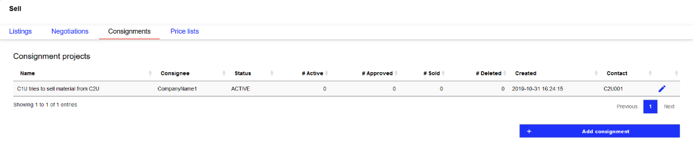
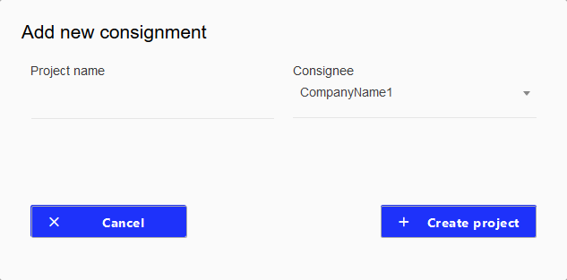
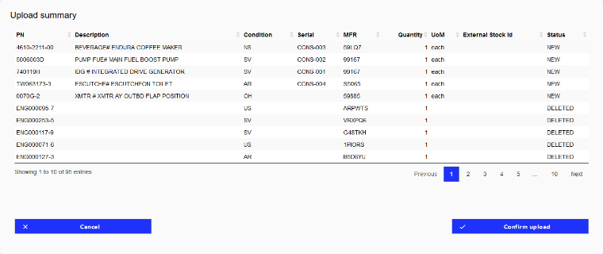
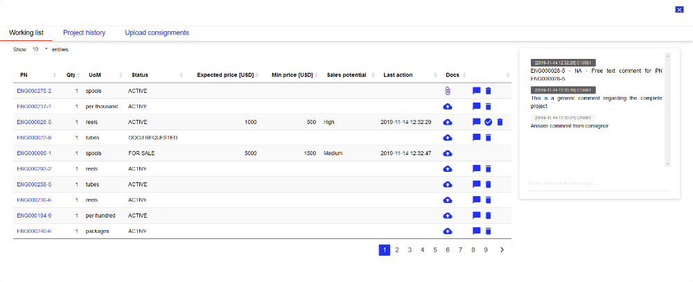
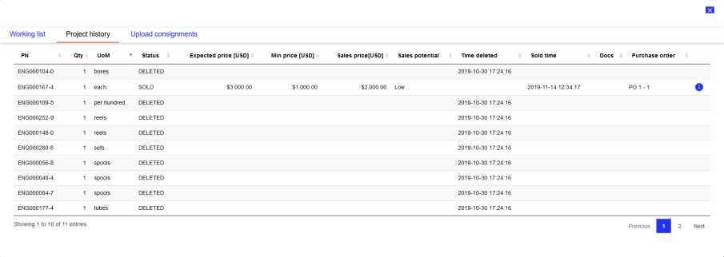

Consignor
---------

The consignment module for consignors is located at Sell - Consignments. There you can find an overview of all active consignment projects of your company.

   Consignment project overview

The overview table shows generic information and relevant KPIs about the consignment projects. 

.. list-table:: 
   :class: tight-table
   :widths: 30 70
   :header-rows: 1

   * - Column
     - Description
   * - Name
     - Name / short description of the consignment project. This value is defined during project creation.
   * - Consignee
     - Company name of consignee company.
   * - Status
     - Can be ACTIVE or CLOSED, indicating the overall status of the consignment project. A consignment project is active for as long as there is uploaded material that is neither deleted nor sold.
   * - # Active / # Approved / # Sold / # Deleted
     - These four columns indicate the total number of material positions within the different categories.
        
        - Active material is still part of the pricing process.
        - Approved material has an approved price proposal and is ready to be sold by the consignee.
        - Sold material has been sold by the consignee.
        - Deleted material has been removed from this project by the consignor.

   * - Created
     - Date and time when the consignment project was initially created.
   * - Contact
     - User ID that created the consignment project.

Clicking the Edit icon |edit| opens the detail screen for this project and allows you to manage the material of this consignment project. A new consignment project is created by clicking on the Add consignment button located in the lower right corner of the screen.

Create a new project
^^^^^^^^^^^^^^^^^^^^

   Modal window to create a new consignment project

Clicking on the Add consignment button opens the a modal window to create a new consignment project:

The project name is a free text input. You should choose a descriptive and understandable name. This improves the recognition and traceability of the project later. The consignee can be selected from all companies with which you have an established trading channel on the platform.

.. note:: In case the company you want to create a consignment project with is not part of the IATA MRO SmartHub, you may contact them and ask them to join the community. However, if you know that the company uses IATA MRO SmartHub and the company is not available in the list of companies, please contact your company administrator and ask them to establish a trading channel with this company. After having established a channel, you will be able to create a consignment project with them.

Clicking on Create project finally creates the consignment project and makes it available for adding material in the overview table.

Manage an existing project
^^^^^^^^^^^^^^^^^^^^^^^^^^
Clicking on the Edit icon |edit| in the project overview table opens the details for the selected consignment project. The detail view consists of three screens: Working list, Project history, and Upload Consignments.

:Working list: This screen shows the current material in this consignment project on part level including all relevant information about the consignment process. The main purpose of this screen is to allow the management of available material in the current consignment project. It includes a chat window on the right side to communicate with the consignee on the platform.
:Project history: This screen shows deleted and sold material that was part of the consignment project.
:Upload consignments: On this screen you can add material to the current consignment project.

Clicking on the Close button |close| in the upper right corner closes the detail view of the current consignment project and returns you to the project overview.

Upload consignments - add consignment material to project
=========================================================
Consignment material can be uploaded via the UI or using an automated web service. In case the automated web service is used, the tab Upload consignments is not available in the UI. All information and requirements to upload consignment material using the UI via CSV files are shown on the Upload consignments page.

CSV Template
************
The CSV file to upload consignment material has to be in an appropriate format to be successfully uploaded to the IATA MRO SmartHub. The expected columns and their content are defined on this page. Columns marked as Required field have to be filled with valid data for every row to upload them as consignment material. 

To simplify the process of creating an appropriate file structure, the platform provides a download link to get an empty CSV template. The download link is located below the column definition. The following table shows all columns in the required order:

.. list-table:: 
   :class: tight-table
   :widths: 30 30 30 10
   :header-rows: 1
   
   * - Column	
     - Description	
     - Allowed values/formats	
     - Required field
   * - part_number
     - Part number
     - The values have to be character strings without any special characters.
     - Yes
   * - part_condition
     - Condition of the consignment part
     - Allowed values: NE, NS, OH, SV, AR, US
     - Yes
   * - part_description
     - Description of the consignment part
     - The values have to be character strings without any special characters.
     - 
   * - serial_number
     - Serial number of the consignment part
     - Only one part number - serial number - manufacturer combination may be uploaded in the database at any time. All duplicates will be rejected. The values have to be character strings without any special characters.
     - Yes
   * - owner_stock_id
     - Internal stock ID of the consignment part, e.g., equipment ID from your internal ERP system.
     - The values have to be character strings.
     - Yes
   * - mfr
     - Manufacturer of the consignment part.
     - The values have to be character strings without any special characters.
     - Yes
   * - mro_approval_number
     - Approval number of the last MRO for the part.
     - The values have to be character strings without any special characters.
     - 
   * - mro_name
     - Name of the last MRO for this part.
     - The values have to be character strings without any special characters.
     - 
   * - lead_time
     - Number of days until the part is ready to be shipped.
     - The values have to be integer numbers.
     - Yes
   * - tag_date
     - Number of the last tag for this part.
     - Allowed formats: YYYY-MM-DD or YYYY/MM/DD. Any date before today.
     - 
   * - last_operator
     - Name of the last operator of the aircraft the part was installed.
     - The values have to be character strings without any special characters.
     - 
   * - incident_related
     - Specify whether this is a part from an incident related aircraft or not.
     - Boolean value. Allowed values: FALSE, TRUE
     - 
   * - consignment_qty
     - Quantity of the consignment part.
     - The values have to be numeric.
     - Yes
   * - consignment_unit
     - Unit of measure of this part.
     - Allowed values: boxes, centimeters, each, feet, gallons, grams, inches, kilometers, kilos, liters, meters, metric tons, millimeters, ounces, packages, pairs, per hundred, per thousand, pints, pounds, quarts, reels, rolls, sets, spools, square feet, square meters, tubes, yards
     - Yes
   * - date_of_manufacture
     - Date when the part was originally manufactured.
     - Allowed formats: YYYY-MM-DD or YYYY/MM/DD. Any date before today.
     - 
   * - time_remaining
     - If applicable: time remaining for this part in days.
     - The values have to be integer numbers.
     - 
   * - cycles_remaining
     - If applicable: cycles remaining for this part.
     - The values have to be integer numbers.
     - 
   * - shelf_life
     - If applicable: shelf life for this part.
     - Allowed formats: YYYY-MM-DD or YYYY/MM/DD. Any date after today.
     - 
   * - part_location
     - Geographic location where the part is stored. The location has to be specified as the closest airport with a IATA 3-letter-code.
     - Allowed values: only IATA 3-letter-codes.
     - 

.. note:: When preparing the CSV file to upload consignment material, the column order must not change. Otherwise, a correct processing of the upload cannot be guaranteed. 

To correctly process the uploaded data, please do not change the column order when editing the CSV template. The part number, serial number, part condition, and manufacturer are used to uniquely identify a particular part. For serialized material, a unique combination can only occur once in the uploaded data. For unserialized material, the processing will aggregate the quantity if multiple lines for the same part exist.

Initial upload of material
**************************
To initially add material to the consignment project a non-empty CSV template is uploaded. Clicking on Select file opens a file selection window that allows you to select and upload the CSV file with the consignment material that is stored on your computer. After uploading the file, the platform will check for data consistency and validity. In case inconsistencies or invalid data sets are identified, you will be notified about the issues on the screen. Data sets with inconsistencies are not imported to the platform. Only data sets with consistent and valid data are completely processed and prepared to be added to the consignment project.

To validate the uploaded material from your side, the material to be imported is shown in a new modal window. In this upload summary you may check the material and either confirm the upload by clicking Confirm upload or cancel the upload process by clicking Cancel. When confirming the upload, the material is listed in the consignment project and is immediately available for the consignee.

Updating the consignment material
*********************************
The platform allows different ways of updating the material inside a consignment project. We differentiate two ways: Deleting and updating the material list.

:Deleting material: Individual parts can be deleted from the consignment project in the Working list screen. For each row, the Trash |trash| will remove this part from the consignment project. For documentation purposes, the part will still be listed in the project history.

:Updating material: An existing material list of a consignment project can be updated using the CSV file upload. Every time a new CSV file is uploaded the platform compares the existing material with the newly uploaded material. Additions, deletions, and updates of material are recognized and respectively handled. In the upload summary window, the column Status shows the type of change compared to the currently available material list on the platform. Status NEW indicates that this material will be added to the consignment project. DELETED marks material that is not available in the uploaded data but currently available in the consignment project and therefore will be deleted from the project. UPDATED marks material that has changed properties such as quantity or price. 

This comparison process allows you to update the material of a consignment project, however, it also brings requirements for the content and format of the uploaded data: The part number, serial number, part condition, and manufacturer are used to uniquely identify a particular part. To correctly identify changes in the material list these values must not change for a particular part between two uploads. For serialized material, a unique combination can only occur once in the uploaded data. For unserialized material, the processing will aggregate the quantity if multiple lines for the same part exist. 

This update functionality will preserve all changes and information that have been added to a particular part in the consignment project. Price proposals, comments, documentation are still available - as long as the part is in the updated list - after updating the consignment material list for a project.

   Modal window showing upload summary after importing parts via CSV

Price proposal process with consignee
=====================================
The core element of the consignment module is the price proposal process between consignor and consignee. All relevant actions for this process take place in the Working list. The following diagram shows the price proposal process including the sales component at the end of the process.

[PROCESS DIAGRAM]

After uploading the material, the consignee has to propose a minimum price (USD), an expected price (USD) and a sales potential for every material in the consignment project. These prices and the sales potential are shown to the consignor. After agreeing with the consignee on a set of prices for a material, the consignor approves a material for sale.

Working list screen
===================
The following image shows the Working list screen for the consignor. 

   Worklist screen

The working list table shows the available material in the currently selected consignment project. For each material, a set of actions is available to manage the material:

:PN details: By clicking on the part number a modal window shows additional information for this material: Generic material information based on the material catalogue on the platform and part specific information that have been uploaded when adding the part to the consignment project.

:Upload documentation: If required, the consignee may request documentation from the consignor by clicking on the Upload icon |upload|. Parts where documentation has been requested are marked with status DOCU REQUESTED. For more details regarding the upload process for documentation, see Upload PDF documentation.

Add part specific comment: Clicking on the icon |comment| opens a modal window where a part specific comment can be added. All comments will be displayed in the chat box on the right side of the screen. For part specific comments, the part number and serial number are automatically added in front of the comment. For more details regarding the chat functionality, see Chat functionality.
Approve proposed sales prices: By clicking on |check| the consignor approves the prices proposed by the consignee and allows the consignee to start selling this material. The status of the part will change from ACTIVE to FOR SALE when approving the price proposal.
:Delete material: Clicking on the Delete icon |trash| will delete material. See Deleting material.

Upload PDF documentation
========================
Clicking on the icon |upload| opens the dialog to add a PDF file to the selected material as documentation.

Chat functionality
==================
On the right side of the Working list screen the chat module is located. A chat is dedicated to a particular consignment project and is only accessible from inside the project. The chat window consists of the chat history showing all messages that have been sent and the message input field. There are two types of messages inside the chat: material related messages and general messages. The header of a message contains the date and time the message was sent and the username of the sender.

Material related messages can be added by clicking on the chat icon in the working list table. These messages always have a part number and serial number prefix, to identify the material they are related to.

General messages can be entered in the input field below the chat history. They are sent by pressing the Enter key on the keyboard.

Project history
^^^^^^^^^^^^^^^
The screen Project history shows all material that have been part of the consignment project and have already been deleted by the consignor (status DELETED) or sold by the consignee (status SOLD). For sold material, additional information regarding the transaction are shown: expected price, minimum price, actual sales price, and the purchase order number. Additional details for a sale can be accessed by clicking on the info icon |info|. 

   Project history screen

The additional information regarding the transaction are added by the consignee when marking the material as sold. There are required fields which have to be filled for each transaction: buyer company name, sales price (USD), sales quantity, purchase order number, and purchase order position. All other fields are optional.

Close an existing consignment project
^^^^^^^^^^^^^^^^^^^^^^^^^^^^^^^^^^^^^
An active consignment project is automatically closed if there is no more material with status ACTIVE, DOCU REQUESTED or FOR SALE. The project will be marked as CLOSED and will no longer be available for consignor and consignee.

A statistical evaluation of the package can be found under menu "Statistics".