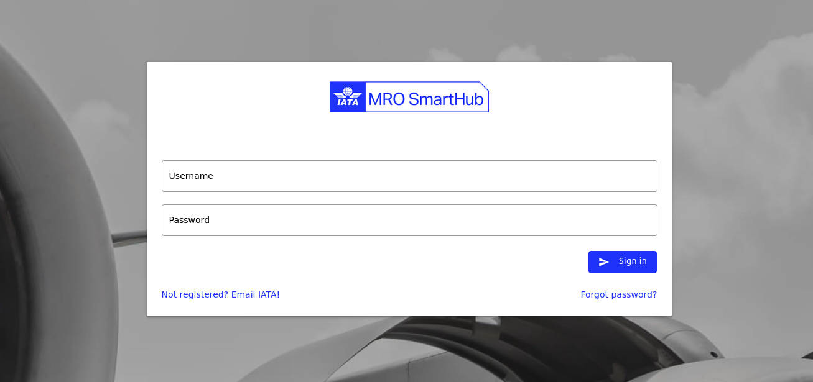

Preliminaries
-------------

Accessing IATA MRO SmartHub
===========================
IATA MRO SmartHub application can be easily accessed via an internet browser at: https://mrosmarthub.iata.org.

   Login screen of IATA MRO SmartHub

Login process
=============

User accounts for IATA MRO SH are personalized
• Personalization is ensured through 2-factor-authentication
• Company admin sets initial password during creation process
• In case a user lost his password, company admin can reset password

First login
^^^^^^^^^^^

Two factor authorization
^^^^^^^^^^^^^^^^^^^^^^^^

Password handling
^^^^^^^^^^^^^^^^^

User profile
============

Overview
^^^^^^^^

Password change
^^^^^^^^^^^^^^^

User settings
^^^^^^^^^^^^^