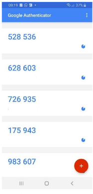
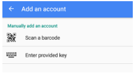

Preliminaries
-------------

Accessing IATA MRO SmartHub
===========================
|mrosh| application can be easily accessed via an internet browser at: https://mrosmarthub.iata.org. The following figure shows the login screen.

The administration of user accounts is done by the company administrator. He can setup the initial login credentials and will provide them to any new user. Furthermore, the company administrator is responsible for authorizing the users to the different submodules of |mrosh| based on their role in the company. Every account on |mrosh| is personalized and can only be used by a single individual. 

.. figure:: img/smarthub_login.png
   :width: 50%
   :alt: Login screen of |mrosh|
   :align: center

   Login screen of |mrosh|

Login process
=============
To login to |mrosh| the user has to enter his username in lowercase letters and the password. On initial login, all users are forced to change their initial password to a personally chosen password.

Two-factor authentication
^^^^^^^^^^^^^^^^^^^^^^^^^
|mrosh| application utilizes two-factor authentication implementing TOTP. To log-in, every user need a TOTP capable application on his mobile device. The following manual is written for Google Authenticator, as it is the recommend applicaiton. However, any another app for the 2-factor-authentication is also applicable. They will work in the same way as Google Authenticator.

   Overview Google Authenticator

- Download and install the application on the mobile phone
- Open the app and add a new account by clicking on the red button (see Fig. Overview Google Authenticator)
- Choose "Scan a barcode" option (see Fig. Google Authenticator - select new account type)
- Scan the barcode provided by |mrosh|

   Google Authenticator - select new account type

After clicking "add", a new entry is available on the main screen providing a 6-digit key that can be entered at |mrosh| for authentication.

Link to Google Authenticator app 
:iOS: https://itunes.apple.com/us/app/google-authenticator/id388497605?mt=8
:Android: https://play.google.com/store/apps/details?id=com.google

Password handling
^^^^^^^^^^^^^^^^^
In case a user has lost his password, the company administrator can reset password and provide a new temporary password.

User profile
============
The "User profile" tab provides an overview of the user account details, the current active authorizations, and enables users to independently change their password for |mrosh|.
