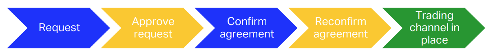

Community
---------
The community menu includes everything around company profile and trading channels. 

Company profile
===============
The profile can be set up in the company administration tool (https://mrosmarthub.iata.org/admin) under menu Community and tab Profile. After setting up and activating your profile, your company will be visible in the tab Overview and you will be able to request trading channels.

To set up your company profile we ask you to provide

- a short description of your company
- a logo image (JPG or PNG)
- your general terms of service (PDF with max. 8MB or link to external website showing your general ToS)

.. note:: A company profile is your companies business card on MRO SmartHub. Having an activated company profile is necessary to establish trading channels with other companies on IATA MRO SmartHub. Therefore, completing, activating, and keeping your company profile up to date is very important.

Trading channels
================
Trading channels are necessary to share information and to interact on IATA MRO SmartHub. A trading channel defines a private connection between two companies on the platform and ensures that shared information are only visible from both companies.

Request a new trading channel
^^^^^^^^^^^^^^^^^^^^^^^^^^^^^
Under menu Community and tab Overview you can now select your trading partner. Clicking on the company logo of the partner opens a dialog where profile details are shown. 

Setting up a new trading channel is a multi-stage process where both companies have to accept and confirm their connection. The following figure visualizes the necessary steps:

   Process of establishing a trading channel

To initiate the request process for a trading channel click on the button Request trading channel. Your partner will now receive the request and has to approve it.

After your request has been approved by your partner, both partners have to confirm that a valid trading agreement between your companies is in place.

The table located under tab Pending trading channels shows the status of the request process. Both parties must confirm and approve the existence of a trading agreement between the parties by clicking the approval icon under Actions.

Once the approval and the confirmation process is completed, the trading channel is active.

Delete trading channel
^^^^^^^^^^^^^^^^^^^^^^
An active trading channels can be deleted by clicking on the trash icon |trash| in the respective line inside the table showing all active trading channels. If desired, you can enter a termination message for your trading partner in the upcoming modal window. After confirming to terminate the trading channel, all visibilities and connections on IATA MRO SmartHub are removed.

If decided later, a trading channel can be re-established following the basic trading-channel process.